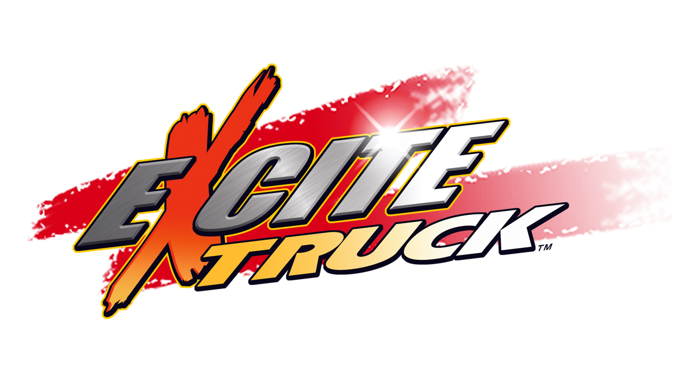

# Excite Patch

Play **Excite Truck** (Wii) with a **GameCube controller** or a **Classic
Controller** instead of waving a Wii Remote, and load your custom-soundtrack
MP3s from an **SDHC card** (over 2 GB). Works with the USA (`REXE01`), European
(`REXP01`) and Japanese (`REXJ01`) releases, and each patch is optional.

The patches are applied to your own copy of the game: drop a clean `.wbfs` or
`.iso` onto the patcher and play the result on a Wii (USB loader) or in
Dolphin. Nothing from the game is included in this repository.



## Status

Tested in Dolphin: the GameCube controller and SDHC patches on all three
releases (scripted pad input; 3 GB and 4 GB SDHC card images), the Classic
Controller patch on the USA release. **Not yet tested on a real Wii** — see
[On a real Wii](#on-a-real-wii).

**Works (in Dolphin):**

- GameCube pad: all buttons, steering with the control stick, the stick
  as the HOME Menu pointer
- Classic Controller: buttons, steering, HOME Menu pointer (Vague Rant's codes)
- an SDHC card mounting and its folders reading (the game then finds the MP3s
  the same way it does on a small card)

**Known limits:**

- a Wii Remote must still be connected. GameCube port 1 drives player 1; ports 2-4
  are wired the same way but untested
- plug the GameCube pad in **before** starting the game; hot-plugging is not handled
- the patched pad replaces the remote's tilt only while a GameCube pad answers —
  unplug it to steer with the remote again
- SDHC needs an IOS that understands SDHC cards: the patcher can set the disc's
  IOS to 58 for you, or set it in your USB loader (see below)

## Controls

### GameCube controller

| Input | Action |
| --- | --- |
| Control stick | Steer · angle in the air |
| A | Accelerate (Wii Remote 2) |
| B | Brake / reverse (Wii Remote 1) |
| X | Reset truck when off track · A in the HOME Menu |
| Y | Wii Remote B (unused in the game) |
| L / R | Turbo boost · menu left / right |
| D-pad | Menu navigation |
| Start | Pause (+) |
| Z | HOME Menu — the control stick moves the pointer, X clicks |

### Classic Controller

| Input | Action |
| --- | --- |
| Left stick | Steer · angle in the air |
| A | Accelerate |
| B | Brake / reverse |
| X | Reset truck when off track (and A in the HOME Menu) |
| L / R / ZL / ZR | Turbo boost · menu left / right |
| D-pad, + | Navigation, pause |
| HOME | HOME Menu — the left stick moves the pointer |

With a Classic Controller on a Wii U (vWii) injection, enable *Force Classic
Controller Connected*.

## Installing

### Patch your disc image

You need a clean `.wbfs` or `.iso` of the game. Download the patcher for your
system from the releases page (or the artifacts of the latest CI run), or run
it from source (needs Python 3 with
tkinter and [Wiimms ISO Tool](https://wit.wiimm.de/) (`wit`) on your `PATH`):

```bash
python3 tools/gui.py
```

Tick the patches you want, then drop the image onto the window (or click to
choose it). The patcher checks the disc id, patches `sys/main.dol`, rebuilds the
image in the same format and replaces your file, keeping the original next to
it as `<name>.bak`. Other releases, and images already modified by something
else, are refused rather than corrupted. You can run it again later to add
another patch.

There is a command-line twin:

```bash
python3 tools/patch_disc.py "Excite Truck (USA).wbfs" --cc --gc --sd --ios 58
```

### Gecko codes (Dolphin)

Copy `codes/<disc id>.ini` (`REXE01`, `REXP01` or `REXJ01`) into Dolphin's
`GameSettings` folder and enable the codes under **Properties → Gecko Codes**.
The three codes are independent. Set GameCube Port 1 to a Standard Controller
and boot with the Wii Remote connected.

The same codes are in `codes/<disc id>.txt` in the plain layout loaders read. On
a real console with a loader's own code handler, prefer the patched disc: a
handler and a patched disc each want the Wii's low memory, and the codes are
sized to leave the handler enough room for them alone.

### Riivolution

`riivolution/<disc id>.xml` is a Riivolution patch with one switch per feature.
Put it in your Riivolution folder (or Dolphin's `Load/Riivolution`) and enable
the options you want. It matches on the disc id and version, so it cannot be
applied to the wrong release.

### Which release do I have?

The disc id is the first six characters of the disc (`REXE01` USA, `REXP01`
Europe, `REXJ01` Japan). `python3 tools/patch_disc.py` and the GUI read it for
you; the Gecko and Riivolution files are named by it.

## On a real Wii

- Play the patched image from a USB loader as usual
  (`wbfs/<Title> [REXE01]/REXE01.wbfs`). Turn the loader's **cheats / debugger
  off** for this game when using the patched image.
- **SDHC cards:** the game asks for IOS 9, which predates SDHC cards (the game even
  has a message for an IOS refusing one: "SDHC card inserted; card is not
  supported"). Tick *make the disc ask for IOS 58* in the patcher (the rebuilt
  disc is fake-signed, like any patched image), or set the game's IOS to 58 in
  your loader's settings.
- Connect the GameCube controller **before** launching the game.
- Put your MP3s in a folder named `EXCITE TRUCK` on the card. The game looks there
  first and, if it finds nothing, searches the whole card for `.mp3` files.

## Building from source

The patcher needs only Python 3 and `wit`. The routines it injects ship
pre-assembled in `tools/prebuilt/` (checked by `tools/check.py`); with
[devkitPPC](https://devkitpro.org/) and your own `main.dol` dumps you can
rebuild them from `src/`:

```bash
EXCITE_DOLS=/dir/with/REXE01.dol,REXP01.dol,REXJ01.dol python3 tools/gen_prebuilt.py
python3 tools/build.py        # regenerate codes/ and riivolution/
python3 tools/check.py        # consistency checks (no game files needed)
EXCITE_DOLS=... python3 tools/verify.py   # checks every patch against the retail DOLs
```

To patch a `main.dol` directly:

```bash
python3 tools/patcher.py <retail main.dol> <patched main.dol> --cc --gc --sd
```

How the patches work is in [docs/TECHNICAL.md](docs/TECHNICAL.md).

## Credits

- **Vague Rant** — the Classic Controller hack (`src/cc/`), including the
  pointer for the HOME Menu. These are his codes; this repository converts them
  into the same format as the other patches so they work in all three install
  methods.
- **Bero** — *SDHC Extension*, the fix this SDHC patch follows (the same fix the
  [ACCF-Patch](https://github.com/quatric/ACCF-Patch) carries for Animal
  Crossing: City Folk).
- The Gecko / WiiRD community for the code format and code handler.

## Contact

quatricsoftware@gmail.com

No support will be provided for this tool.

## License

MIT — see [LICENSE](LICENSE).

Copyright (c) 2026 quatric
